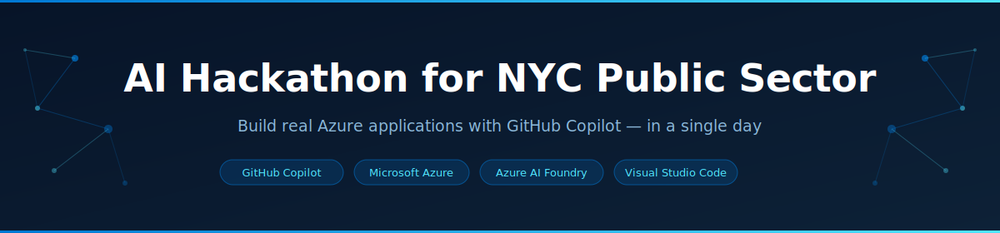

# AI Hackathon for NYC Public Sector




A fast-paced, hands-on event where teams go from idea to working Azure application in a single day — built with GitHub Copilot, working side-by-side with Microsoft engineers.

Participants design, build, and deploy a real Azure application using secure, enterprise-ready services and leave with:

- A **working, deployed Azure application** you built yourself
- Hands-on experience with **GitHub Copilot Agent mode** for real-world development
- Reusable **infrastructure-as-code templates** for Azure deployments
- Practical knowledge of **SLED security patterns** (Managed Identity, RBAC, zero hardcoded secrets)

---

## ⚡ Before You Start

Your **Windows 365 desktop** comes pre-configured with VS Code, GitHub Copilot, Azure CLI, and an active Azure account — no setup required before the event.

To do a quick sanity check, open VS Code, switch Copilot Chat to **Agent mode**, and paste:

```text
Check my Windows 365 environment and confirm I'm ready to start:

1. Run `az account show` — confirm I am logged in to Azure and show me the active subscription name and ID.

2. Confirm the GitHub Copilot extension is installed and signed in to VS Code.

3. If anything is missing or not signed in, fix it now and show me the corrected output.
```

> Each scenario README includes its own environment-check prompt with the specific tools required — run that when you open your chosen scenario.

---

## 🚀 How It Works

1. **Pick a scenario** — Choose one of the challenge scenarios below based on your team's interests and skill set
2. **Use GitHub Copilot** — Follow the prompts in your scenario to generate and build your application in Agent mode
3. **Deploy to Azure** — Get your solution running on Microsoft Azure using the provided infrastructure templates
4. **Present your work** — Demo your application to the group at the end of the event

---

## 📋 Scenarios

| # | Scenario | Description | Difficulty | Tech Stack | Est. Time |
| --- | --- | --- | --- | --- | --- |
| 1 | [SLED Case Management CRUD App](./AI%20Prompt%20Scenarios/Prompt-Scenario-1/README.md) | Secure case management system for a county agency | Intermediate | .NET 10 · React · Cosmos DB · Bicep | ~3–4 hrs |
| 2 | [IaaS Lift & Shift: Permit Management](./AI%20Prompt%20Scenarios/Prompt-Scenario-2/README.md) | Lift-and-shift permit management system to Azure VMs | Intermediate | .NET 8 · SQL Server VM · IIS · Bicep | ~3–4 hrs |
| 3 | [AI Constituent Services Chatbot](./AI%20Prompt%20Scenarios/Prompt-Scenario-3/README.md) | RAG-powered chatbot for government services using Azure OpenAI + Azure AI Search | Advanced | Python · FastAPI · React · Azure OpenAI · AI Search · Bicep | ~4–5 hrs |

> Not sure which to pick? Scenarios 1 and 2 are great starting points for teams focused on web app development. Scenario 3 is ideal for teams interested in AI and RAG patterns.

---

## 🛠️ Tools You'll Use

- **[GitHub Copilot](https://github.com/features/copilot)** — AI-powered code generation directly in VS Code
- **[Microsoft Azure](https://azure.microsoft.com)** — Cloud platform for deploying your application
- **[Azure AI Foundry](https://ai.azure.com)** — Enterprise-grade AI services including Azure OpenAI (Scenario 3)
- **[Visual Studio Code](https://code.visualstudio.com)** — Recommended editor with full Copilot integration

---

## 🗺️ Architecture Overview

```text
┌─────────────────────────────────────────────────────────────────────────┐
│                      Azure Deployments Accelerator                      │
│                              (Terraform)                                │
│          Hub · Bastion · Key Vault · PaaS · IaaS · AI Foundry          │
│                    Optional shared enterprise landing zone              │
└─────────────────────────────────────────────────────────────────────────┘

  ┌──────────────────────┐  ┌──────────────────────┐  ┌──────────────────────┐
  │      Scenario 1      │  │      Scenario 2       │  │      Scenario 3      │
  │  Case Management     │  │  Permit Management    │  │  AI Chatbot (RAG)    │
  │  CRUD App            │  │  IaaS Lift & Shift    │  │                      │
  │ ─────────────────── ─│  │ ──────────────────── ─│  │ ──────────────────── │
  │  ASP.NET Core .NET 10│  │  ASP.NET Core .NET 8  │  │  Python + FastAPI    │
  │  React + TypeScript  │  │  Razor Views + EF Core│  │  React + TypeScript  │
  │  Azure Cosmos DB     │  │  SQL Server 2022 VM   │  │  Azure OpenAI GPT-4o │
  │  Azure Container Apps│  │  Windows Server 2022  │  │  Azure AI Search     │
  │  Azure Static Web    │  │  IIS + Azure Key Vault│  │  Cosmos DB (history) │
  │  Bicep IaC           │  │  Bicep IaC            │  │  App Service + SWA   │
  │ ─────────────────── ─│  │ ──────────────────── ─│  │  Bicep IaC           │
  │  Intermediate · 3–4h │  │  Intermediate · 3–4h  │  │ ──────────────────── │
  └──────────────────────┘  └──────────────────────┘  │  Advanced · 4–5h     │
                                                        └──────────────────────┘
```

---

## 🏗️ Azure Deployments Accelerator

The [Azure Deployments Accelerator](./Azure%20Deployments%20Accelerator%20(Terraform)/README.md) provides ready-to-use Terraform modules for provisioning shared Azure baseline infrastructure across three deployment patterns:

- **Hub** — Core networking, Bastion, Key Vault, and shared services
- **PaaS** — Azure App Service + Azure SQL Database
- **IaaS** — Windows VM (web tier) + SQL Server VM (data tier)
- **AI Foundry** — Azure OpenAI, AI Foundry hub, and Cosmos DB connectivity

> **Bicep vs. Terraform:** The three challenge scenarios each include their own **Bicep** templates for scenario-specific Azure deployments — these are self-contained and generated by Copilot as part of the build. The Accelerator uses **Terraform** and is intended as a shared enterprise baseline (hub-and-spoke networking, centralized Key Vault, Bastion) that can be pre-deployed to provide a production-ready landing zone.
